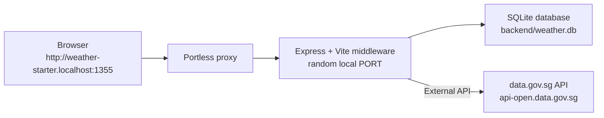

# Weather Starter

A simple TypeScript weather app for agentic coding.

The app tracks Singapore locations and stores their latest weather. It uses a Node/Express backend, a React/Vite frontend, and Portless for a local `.localhost` URL.

## Tech Stack

| Layer        | Tools                                                                 |
| ------------ | --------------------------------------------------------------------- |
| Backend      | Node.js, TypeScript, Express                                          |
| Frontend     | React 18, Vite, Tailwind CSS                                          |
| Dev URL      | Portless named `.localhost` URLs                                      |
| External API | Singapore data.gov.sg (`api-open.data.gov.sg`)                        |
| Storage      | SQLite database at `backend/weather.db` through Drizzle ORM           |

## Architecture



The backend and frontend run in one Node process during development. Express serves `/api/*`. Vite serves the React app. The frontend uses relative `/api` requests. You do not need port configuration.

## Quick Start

Install dependencies:

```bash
npm install
```

Start the app:

```bash
npm run dev
```

The app uses Portless on a normal local port. You do not need sudo or certificates. Open the URL that Portless prints. Usually, it is:

```text
http://weather-starter.localhost:1355
```

## Useful Commands

```bash
npm run dev      # Start Express + Vite through Portless
npm run build    # Build the frontend and compile backend TypeScript
npm run start    # Run the compiled production server
npm test         # Run backend API tests
npm run test:watch # Run backend API tests in watch mode
npm run doctor   # Verify /health and /api/locations
npm run reset    # Remove the local SQLite database
npm run db:generate # Generate Drizzle migrations after schema changes
npm run db:migrate  # Apply Drizzle migrations to backend/weather.db
```

## API

| Method | Endpoint                     | Description                    |
| ------ | ---------------------------- | ------------------------------ |
| `GET`  | `/health`                    | Health check                   |
| `GET`  | `/api/locations`             | List all locations             |
| `POST` | `/api/locations`             | Create a location              |
| `GET`  | `/api/locations/:id`         | Get a single location          |
| `POST` | `/api/locations/:id/refresh` | Refresh weather for a location |

Create a location:

```bash
curl -s -X POST http://weather-starter.localhost:1355/api/locations \
  -H "Content-Type: application/json" \
  -d '{"latitude": 1.35, "longitude": 103.85}'
```

Refresh weather:

```bash
curl -s -X POST http://weather-starter.localhost:1355/api/locations/1/refresh
```

## Data Flow

The app uses a snapshot pattern. It does not call the external API on every page load:

1. You create a location. The app saves the coordinates and adds a placeholder status.
2. The backend fetches data from data.gov.sg. It saves the snapshot and returns the location.
3. The app lists locations from `backend/weather.db` using Drizzle ORM.
4. You trigger a manual refresh. The app fetches new data, saves the snapshot, and returns the location.

## Project Structure

```text
weather-starter/
├── backend/
│   ├── drizzle/                       # Generated Drizzle SQL migrations
│   ├── package.json
│   ├── tsconfig.json
│   └── src/
│       ├── server.ts                  # Express app + Vite middleware
│       ├── db.ts                      # SQLite connection and data access helpers
│       ├── logger.ts                  # Structured app logger
│       ├── schema.ts                  # Drizzle table definitions
│       ├── weather.ts                 # Singapore weather API client
│       └── routes/
│           ├── locations.ts           # Location endpoints
│           └── locations.test.ts      # Location API tests
├── frontend/
│   ├── index.html
│   ├── package.json
│   ├── postcss.config.js
│   ├── tailwind.config.js
│   ├── vite.config.ts
│   └── src/
│       ├── main.tsx
│       ├── App.tsx
│       ├── api.ts
│       ├── state/
│       ├── components/
│       └── index.css
├── scripts/
│   ├── dev.mjs
│   ├── start.mjs
│   ├── doctor.mjs
│   └── reset.mjs
├── package.json
└── package-lock.json
```

## External API Reference

The base URL is `https://api-open.data.gov.sg`. You do not need an API key for basic use. High traffic may trigger rate limits.

| Endpoint                                       | Docs                                                                                        | Notes                                                                                         |
| ---------------------------------------------- | ------------------------------------------------------------------------------------------- | --------------------------------------------------------------------------------------------- |
| `GET /v2/real-time/api/two-hr-forecast`        | [2-hour Forecast](https://data.gov.sg/datasets/d_3f9e064e25005b0e42969944ccaf2e7a/view)     | The app uses this. Response has `area_metadata` and forecasts.                                |
| `GET /v2/real-time/api/air-temperature`        | [Realtime Weather Readings](https://data.gov.sg/collections/realtime-weather-readings/view) | Station temperature in Celsius.                                                               |
| `GET /v2/real-time/api/relative-humidity`      | [Realtime Weather Readings](https://data.gov.sg/collections/realtime-weather-readings/view) | Station humidity percentage.                                                                  |
| `GET /v2/real-time/api/rainfall`               | [Realtime Weather Readings](https://data.gov.sg/collections/realtime-weather-readings/view) | Station rainfall in mm.                                                                       |
| `GET /v2/real-time/api/wind-speed`             | [Realtime Weather Readings](https://data.gov.sg/collections/realtime-weather-readings/view) | Station wind speed in knots.                                                                  |
| `GET /v2/real-time/api/wind-direction`         | [Realtime Weather Readings](https://data.gov.sg/collections/realtime-weather-readings/view) | Station wind direction in degrees.                                                            |
| `GET /v1/environment/24-hour-weather-forecast` | [Weather Forecast](https://data.gov.sg/collections/weather-forecast/view)                   | 24-hour forecast in time blocks. This has a different shape than the 2-hour endpoint.         |
| `GET /v1/environment/4-day-weather-forecast`   | [Weather Forecast](https://data.gov.sg/collections/weather-forecast/view)                   | 4-day outlook with temperatures and text.                                                     |

Use an API key:

```bash
export WEATHER_API_KEY=your_api_key_here
npm run dev
```

## Feature Tasks

These tasks range from simple to hard. Each one builds on the code and adds concepts. File names may differ, but the behavior must stay the same.

### 1. Delete a location

Add a `DELETE /api/locations/:id` endpoint. Add a delete button to cards in `SidebarCard.tsx`.

| Layer    | Action                                  |
| -------- | --------------------------------------- |
| Backend  | Add DELETE endpoint for locations       |
| Frontend | Add button to `SidebarCard.tsx`         |

### 2. Geolocation + auto-detect

Add a "Use my location" button. It must find the user's position, get the nearest Singapore area, and add it. This works on local setups. For HTTPS, run Portless with `PORTLESS_HTTPS=1`.

| Layer    | Action                                                                              |
| -------- | ----------------------------------------------------------------------------------- |
| Backend  | No changes if nearest-area logic exists                                             |
| Frontend | Add button to `AddLocationForm.tsx` using Geolocation API. Auto-refresh after adding. |

### 3. Singapore area picker

Replace lat/lon inputs with a dropdown. The 2-hour forecast has `area_metadata` with names and coordinates.

| Layer        | Action                                                                                      |
| ------------ | ------------------------------------------------------------------------------------------- |
| Backend      | Return forecast areas if the frontend needs them                                            |
| Frontend     | Replace lat/lon fields with a dropdown using `area_metadata`                                |
| External API | `GET /v2/real-time/api/two-hr-forecast` -> `area_metadata` array                            |

### 4. Current conditions

Show temperature, humidity, and rainfall next to the forecast. These share the station-reading pattern with coordinates.

| Layer        | Action                                                                                                               |
| ------------ | -------------------------------------------------------------------------------------------------------------------- |
| Backend      | Fetch weather data and save the extra fields                                                                         |
| Frontend     | Update location cards to show temperature, humidity, and rainfall                                                    |
| External API | `GET /v2/real-time/api/air-temperature`, `GET /v2/real-time/api/relative-humidity`, `GET /v2/real-time/api/rainfall` |

### 5. Hourly and daily forecast

Add an hourly timeline and a 4-day forecast below the conditions. The 24-hour endpoint returns data by region. The 4-day endpoint gives daily ranges and text. These `v1` endpoints use a different shape than the 2-hour API.

| Layer        | Action                                                                                                                |
| ------------ | --------------------------------------------------------------------------------------------------------------------- |
| Backend      | Add methods and endpoints, like `GET /api/locations/:id/forecast`                                                     |
| Frontend     | Build a scrolling hourly row and a daily list showing text, icons, and temperatures                                   |
| External API | `GET /v1/environment/24-hour-weather-forecast`, `GET /v1/environment/4-day-weather-forecast`                          |

### 6. Wind and atmospheric data

Add a section for wind speed and direction. Show wind with an arrow or animation.

| Layer        | Action                                                                          |
| ------------ | ------------------------------------------------------------------------------- |
| Backend      | Fetch wind data and update refresh logic or add an endpoint                     |
| Frontend     | Create a `WindCompass` component to show wind visually                           |
| External API | `GET /v2/real-time/api/wind-speed`, `GET /v2/real-time/api/wind-direction`      |

### 7. UI and theming

Redesign the app layout. Use nice cards, clear icons, responsive design, and smooth states. Build a modern dashboard that keeps workflows obvious.

Add a map card. Show saved locations as pins with weather labels. The card expands to full-screen. Users still add locations via the main form, not the map.

| Layer        | Action                                                                                                                                           |
| ------------ | ------------------------------------------------------------------------------------------------------------------------------------------------ |
| Backend      | None                                                                                                                                             |
| Frontend     | Restyle components using Tailwind. Add icons, colors, mobile support, and a map card with Leaflet or similar tool.                               |
| NPM packages | `leaflet`, `react-leaflet` or equivalent                                                                                                         |

### 8. Detail page with charts

Add a detail view. Show charts for past temperature, rainfall, and humidity. Save each refresh as a new reading instead of replacing the snapshot.

| Layer        | Action                                                                                    |
| ------------ | ----------------------------------------------------------------------------------------- |
| Backend      | Add history model and endpoint for time-series data                                       |
| Frontend     | Build a detail page with charts using Recharts, Chart.js, or similar library              |
| NPM packages | `react-router-dom`, `recharts` or equivalent                                              |

### 9. Multi-location management

Let users sort locations, pick a primary one, and swipe on mobile. The app shows the primary location first.

| Layer    | Action                                                                        |
| -------- | ----------------------------------------------------------------------------- |
| Backend  | Add sort and default data to the database and API                             |
| Frontend | Add drag-and-drop or up/down buttons. Support swipeable cards on mobile apps. |
