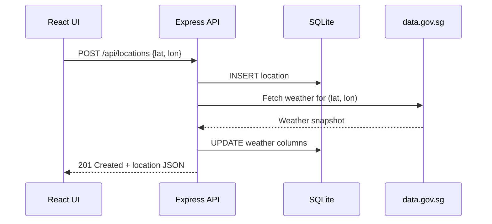

Weather Starter tracks weather for user-saved Singapore coordinates. This guide explains the full lifecycle of a location.

## Creating a Location

1. Click the **+** button in the sidebar.
2. Enter a latitude and longitude within Singapore's bounding box:
   - Latitude: `1.1` – `1.5`
   - Longitude: `103.6` – `104.1`
3. Submit the form.

The frontend sends a `POST /api/locations` request with the coordinates. The backend:

1. Validates the coordinates are within range.
2. Checks for duplicates (same lat/lon pair).
3. Inserts a new row in the `locations` table with default weather.
4. Immediately calls the weather provider to fetch a snapshot.
5. Returns the location with weather data (or default weather if the provider fails).

## Refreshing Weather

Click the **Refresh** button on a location's detail view. This calls `POST /api/locations/:id/refresh`, which:

1. Looks up the location's coordinates in SQLite.
2. Fetches fresh data from all data.gov.sg endpoints.
3. Updates the weather columns in the database.
4. Returns the updated location.

If the weather provider is unreachable or rate-limited, the endpoint returns `502 Bad Gateway`.

## Deleting a Location

Click the **×** button on a sidebar card. This sends `DELETE /api/locations/:id`, which removes the row from SQLite. The sidebar re-fetches the location list, and the selection shifts to the first remaining location.

## Searching Locations

The sidebar search box filters the list by area name or weather condition. This is a frontend-only filter — no API call is made.
