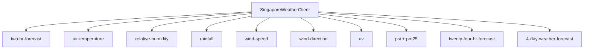

## Data Sources

All weather data comes from Singapore's [data.gov.sg](https://data.gov.sg) open APIs. The `SingaporeWeatherClient` class calls multiple endpoints in sequence and merges the results into a single `WeatherSnapshot`.



## API Endpoints Used

| Endpoint | Base | Provides |
| --- | --- | --- |
| `/v2/real-time/api/two-hr-forecast` | `api-open.data.gov.sg` | Condition text, area name, valid period |
| `/v2/real-time/api/air-temperature` | `api-open.data.gov.sg` | Temperature (°C) |
| `/v2/real-time/api/relative-humidity` | `api-open.data.gov.sg` | Humidity (%) |
| `/v2/real-time/api/rainfall` | `api-open.data.gov.sg` | Rainfall (mm) |
| `/v2/real-time/api/wind-speed` | `api-open.data.gov.sg` | Wind speed (knots) |
| `/v2/real-time/api/wind-direction` | `api-open.data.gov.sg` | Wind direction (degrees) |
| `/v2/real-time/api/uv` | `api-open.data.gov.sg` | UV index |
| `/v2/real-time/api/psi` | `api-open.data.gov.sg` | 24-hour PSI |
| `/v2/real-time/api/pm25` | `api-open.data.gov.sg` | 1-hour PM2.5 |
| `/v2/real-time/api/twenty-four-hr-forecast` | `api-open.data.gov.sg` | Forecast high/low temps, period forecasts |
| `/v1/environment/4-day-weather-forecast` | `api.data.gov.sg` _(legacy)_ | 4-day daily forecast |

## Nearest-Station Matching

Station-based readings (temperature, humidity, rainfall, wind) include a list of stations with lat/lon coordinates. The client finds the nearest station to the user's saved coordinate using squared Euclidean distance:

```
distance = (stationLat − userLat)² + (stationLon − userLon)²
```

Only stations that have a value in the latest reading are considered.

## Region Matching

Region-based readings (PSI, PM2.5, 24-hour forecast) use five fixed Singapore regions: `west`, `north`, `central`, `south`, `east`. The client picks the nearest region to the user's coordinate and reads that region's value.

## Error Handling

Each API call is wrapped in a `settle` helper that catches errors individually. If one endpoint fails, the remaining data is still included in the snapshot — failed fields are set to `null`. This means the dashboard always renders; individual tiles simply show `--` when data is unavailable.

The `fetchJson` method handles:

- **Timeout** — Aborts after 8 seconds (configurable).
- **Rate limiting** — HTTP 429 throws a `WeatherProviderError`.
- **Auth errors** — HTTP 401/403 throws with a check-API-key hint.
- **Network failures** — Caught and rethrown as `WeatherProviderError`.
