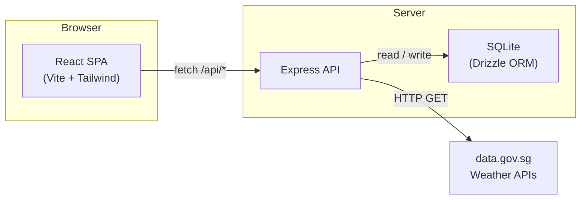

import { Card, CardGrid } from '@astrojs/starlight/components';

## What is Weather Starter?

Weather Starter is an educational full-stack monorepo that pulls real-time weather observations from Singapore's open data APIs. Users save coordinates, and the app fetches forecasts, temperature, humidity, wind, rainfall, air quality, and UV readings for the nearest station.

## Architecture at a Glance

## Key Features

<CardGrid stagger>
  <Card title="Real-Time Data" icon="sun">
    Pulls 2-hour forecasts, temperature, humidity, wind, rainfall, UV index, PSI, and PM2.5 from Singapore's open-data APIs.
  </Card>
  <Card title="Location Tracking" icon="pencil">
    Save multiple Singapore coordinates. Each location gets its own weather snapshot with nearest-station matching.
  </Card>
  <Card title="Apple-Style Dashboard" icon="laptop">
    Sidebar + hero layout with hourly forecasts, 4-day outlook, interactive Leaflet map, and metric tiles.
  </Card>
  <Card title="Multiple Themes" icon="setting">
    Switch between Apple, Cotton Candy, Night City, Pixel, and Terminal visual themes.
  </Card>
</CardGrid>
