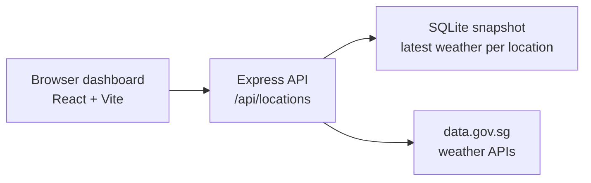

import { LinkCard } from '@astrojs/starlight/components';

## What is Weather Starter?

Weather Starter is an educational full-stack TypeScript app for saving Singapore locations and viewing the latest weather snapshot for each saved place. The dashboard combines a React/Vite interface, an Express API, SQLite persistence through Drizzle ORM, and Singapore data.gov.sg weather endpoints.

  

    
Weather model

    
One latest snapshot per saved location

  

  

    
Location workflows

    
Manual coordinates or browser geolocation

  

  

    
Primary data

    
2-hour, 24-hour, realtime, and 4-day signals

  

## Architecture at a Glance

  

    <strong>Browser dashboard</strong>
    React, Vite, Tailwind, theme state, and Leaflet map UI.
  

  

    <strong>Express API</strong>
    Location routes validate input, refresh weather, and expose JSON responses.
  

  

    <strong>SQLite snapshot</strong>
    Drizzle stores saved coordinates and the latest weather fields.
  

  

    <strong>data.gov.sg</strong>
    Provider calls aggregate Singapore forecasts, readings, UV, and air quality.
  

The development runtime serves the dashboard and API from one Portless URL, so browser code can use relative `/api` requests. Production builds compile the dashboard and let Express serve `frontend/dist`.

## Choose a Path

  <LinkCard
    title="Run the app"
    href="/weather_starter/guides/getting-started/"
    description="Install dependencies, start the Portless dev URL, and verify the local dashboard."
  />
  <LinkCard
    title="Add locations"
    href="/weather_starter/guides/adding-locations/"
    description="Use coordinates or browser geolocation to save Singapore forecast areas."
  />
  <LinkCard
    title="Understand weather data"
    href="/weather_starter/guides/weather-data/"
    description="Trace data.gov.sg provider calls into forecast periods, metrics, and stored snapshots."
  />
  <LinkCard
    title="Inspect implementation"
    href="/weather_starter/reference/frontend-components/"
    description="Review the React component tree, state stores, API client, and Leaflet map surface."
  />

## Implementation Map

  <section class="landing-implementation__panel">
    <h3>Backend API</h3>
    
<code>backend/src/server.ts</code> creates Express, security headers, frontend logging, and Vite/static serving. <code>backend/src/routes/locations.ts</code> owns location endpoints. See <a href="/weather_starter/reference/api-endpoints/">API endpoints</a>.

  </section>
  <section class="landing-implementation__panel">
    <h3>Weather data</h3>
    
<code>backend/src/weather.ts</code> maps data.gov.sg responses into the snapshot rendered by the dashboard. See <a href="/weather_starter/guides/weather-data/">Weather Data Pipeline</a>.

  </section>
  <section class="landing-implementation__panel">
    <h3>Persistence</h3>
    
<code>backend/src/db.ts</code> and <code>backend/src/schema.ts</code> manage Drizzle, migrations, and snapshot columns. See <a href="/weather_starter/reference/database-schema/">Database Schema</a>.

  </section>
  <section class="landing-implementation__panel">
    <h3>Dashboard UI</h3>
    
<code>frontend/src/App.tsx</code>, <code>frontend/src/state/</code>, and <code>frontend/src/components/</code> render locations, forecast strips, metric tiles, themes, and the map. See <a href="/weather_starter/reference/frontend-components/">Frontend Components</a>.

  </section>

