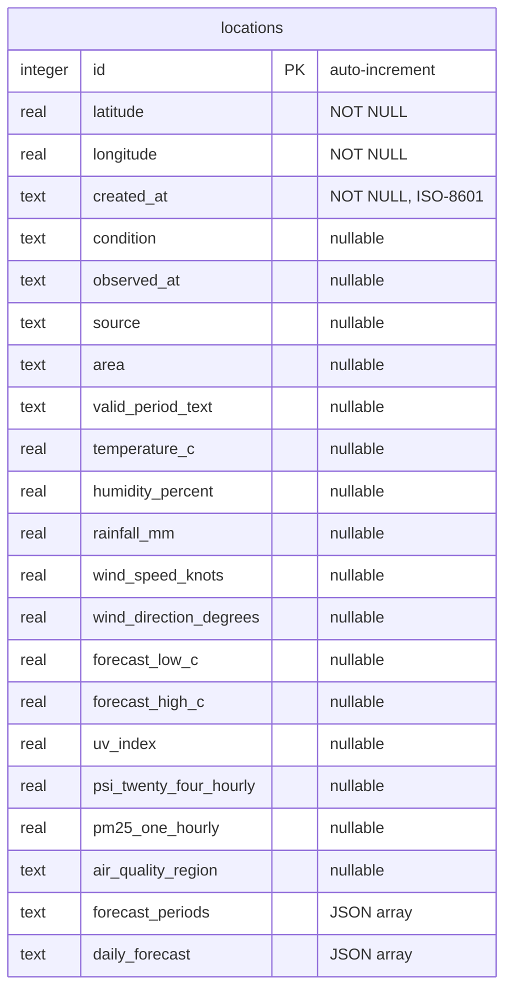

Weather Starter uses a single SQLite database managed by [Drizzle ORM](https://orm.drizzle.team). The database file defaults to `backend/weather.db` and uses WAL journal mode.

## Entity Relationship



## Table: `locations`

Defined in `backend/src/schema.ts` using Drizzle's `sqliteTable` helper.

### Columns

| Column | SQLite Type | Nullable | Notes |
| --- | --- | --- | --- |
| `id` | `INTEGER` | No | Primary key, auto-increment |
| `latitude` | `REAL` | No | |
| `longitude` | `REAL` | No | |
| `created_at` | `TEXT` | No | ISO-8601 timestamp |
| `condition` | `TEXT` | Yes | e.g. "Cloudy", "Fair" |
| `observed_at` | `TEXT` | Yes | Latest observation timestamp |
| `source` | `TEXT` | Yes | e.g. "api-open.data.gov.sg" |
| `area` | `TEXT` | Yes | Nearest area name |
| `valid_period_text` | `TEXT` | Yes | e.g. "6.30 pm to 12.30 am" |
| `temperature_c` | `REAL` | Yes | Celsius |
| `humidity_percent` | `REAL` | Yes | Percent |
| `rainfall_mm` | `REAL` | Yes | Millimeters |
| `wind_speed_knots` | `REAL` | Yes | Knots |
| `wind_direction_degrees` | `REAL` | Yes | Degrees (0–360) |
| `forecast_low_c` | `REAL` | Yes | 24-hour forecast low |
| `forecast_high_c` | `REAL` | Yes | 24-hour forecast high |
| `uv_index` | `REAL` | Yes | UV index value |
| `psi_twenty_four_hourly` | `REAL` | Yes | 24-hour PSI reading |
| `pm25_one_hourly` | `REAL` | Yes | 1-hour PM2.5 reading |
| `air_quality_region` | `TEXT` | Yes | Region name for PSI/PM2.5 |
| `forecast_periods` | `TEXT` (JSON) | No | Array of `{ label, forecast }` |
| `daily_forecast` | `TEXT` (JSON) | No | Array of `{ date, forecast, temperature_low_c, temperature_high_c }` |

### Indexes

- **`locations_latitude_longitude_unique`** — Unique index on `(latitude, longitude)` to prevent duplicate locations.

## Migrations

Migrations are stored in `backend/drizzle/` and run automatically on server startup via `drizzle-orm/sqlite-proxy/migrator`.

### Generate a Migration

After editing `backend/src/schema.ts`:

```bash
npm run db:generate
```

### Apply Migrations

Migrations are applied automatically when the server starts. To run them manually:

```bash
npm run db:migrate
```

## Database Helpers

The `backend/src/db.ts` module exports these async functions:

| Function | Description |
| --- | --- |
| `listLocations()` | Returns all locations ordered by newest first |
| `createLocation(lat, lon)` | Inserts a location with default weather; throws `DuplicateLocationError` on conflict |
| `getLocation(id)` | Returns a single location or `null` |
| `updateWeather(id, snapshot)` | Updates weather columns for a location |
| `deleteLocation(id)` | Deletes a location by ID |
| `resetStore()` | Deletes all locations and resets auto-increment |
