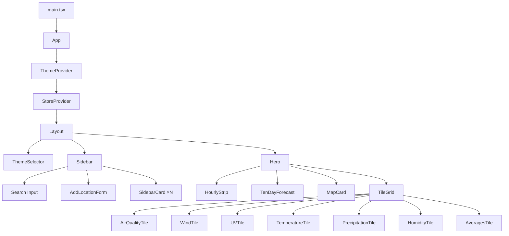

## Component Tree

## State Management

State is managed through two React Context providers. No external state library is used.

### `StoreProvider` (`state/store.tsx`)

Holds all application state for locations and exposes actions through a `StoreValue` context:

| Field | Type | Description |
| --- | --- | --- |
| `locations` | `Location[]` | All saved locations |
| `selectedId` | `number \| null` | Currently selected location ID |
| `isAdding` | `boolean` | Whether the add-location form is visible |
| `isLoading` | `boolean` | Initial load in progress |
| `refreshingId` | `number \| null` | Location currently being refreshed |
| `error` | `unknown` | Last error, if any |

**Actions:**

| Action | Description |
| --- | --- |
| `select(id)` | Select a location |
| `setAdding(flag)` | Toggle the add-location form |
| `create(payload)` | Create a location via the API |
| `refresh(id)` | Refresh weather for a location |
| `remove(id)` | Delete a location |

### `ThemeProvider` (`state/themeStore.tsx`)

Manages the active visual theme. The selected theme is persisted in `localStorage` under the key `weather_starter_theme`.

Available themes: `apple`, `cotton-candy`, `night-city`, `pixel`, `terminal`.

The provider applies a `theme-{name}` CSS class to `document.body` on change.

## Key Components

### `Sidebar`

The left panel that lists all locations as `SidebarCard` components. Includes a search input that filters locations by area name or condition (frontend-only filter). Contains the `AddLocationForm` for creating new locations.

### `Hero`

The main content area showing the selected location's weather. Displays:

- Area name and current temperature
- Condition text and high/low forecast
- Observation timestamp and source
- A **Refresh** button that triggers `POST /api/locations/:id/refresh`

### `HourlyStrip`

A horizontal scrollable strip of forecast periods (e.g. "Morning", "Afternoon") with their condition text.

### `TenDayForecast`

Displays the 4-day weather forecast as a vertical list with daily high/low temperatures and condition text.

### `MapCard`

An interactive Leaflet map showing all saved locations as markers. Built with `react-leaflet`.

### `TileGrid`

A responsive CSS Grid of weather metric tiles:

| Tile | Data Shown |
| --- | --- |
| Air Quality | 24-hr PSI, PM2.5, region, scale bar |
| Wind | Speed (km/h), direction (degrees), compass |
| UV Index | UV value, label (Low–Extreme), scale bar |
| Temperature | Current temperature from nearest station |
| Rainfall | Latest rainfall reading (mm) |
| Humidity | Relative humidity (%) |
| Averages | Forecast high temperature |

## API Client (`api.ts`)

The frontend communicates with the backend through a thin `fetch` wrapper in `src/api.ts`:

| Function | HTTP Method | Endpoint |
| --- | --- | --- |
| `listLocations()` | `GET` | `/api/locations` |
| `createLocation(payload)` | `POST` | `/api/locations` |
| `deleteLocation(id)` | `DELETE` | `/api/locations/:id` |
| `refreshLocation(id)` | `POST` | `/api/locations/:id/refresh` |
| `logInteraction(event, metadata)` | `POST` | `/api/logs` |
